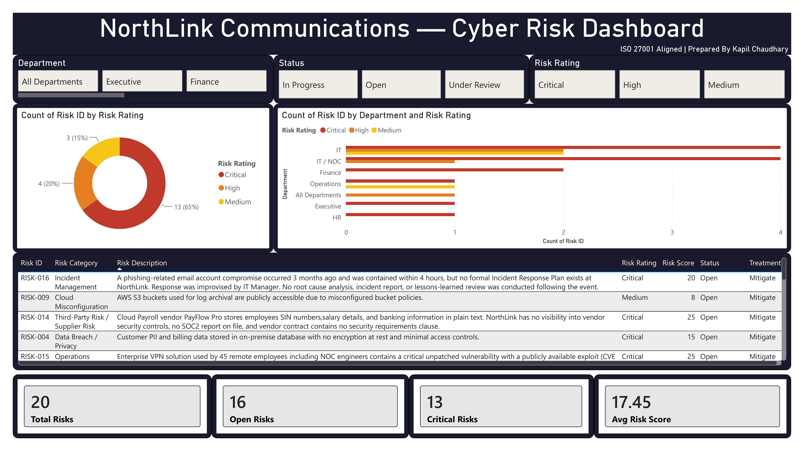

# NorthLink Communications — Cyber Risk Register & Dashboard

A 20-risk cyber risk assessment built for a fictional Canadian ISP (NorthLink Communications), modeled on real NOC and WAN infrastructure experience across 145+ remote sites. Built to demonstrate practical, end-to-end GRC risk analysis — identification, scoring, control gap analysis, and treatment planning — aligned to ISO 27001:2022.

---

## What this demonstrates

- **Risk identification across 20 real-world scenarios** spanning access control, third-party/vendor risk, data breach, social engineering, physical security, business continuity, insider threat, cloud misconfiguration, cryptographic controls, incident management, mobile device management (BYOD), and compliance.
- **A documented Likelihood × Impact scoring methodology** (1–5 scale each), producing a 1–25 risk score and a four-tier rating (Critical / High / Medium / Low), so every score is defensible and repeatable — not a gut-feel guess.
- **Control gap analysis** — for every risk, what control already exists (even partial ones) is separated from what's missing, which is what actually drives the recommendation.
- **ISO 27001 Annex A mapping** — each risk is tied to a specific Annex A control domain (e.g., A.9 Access Control, A.15 Supplier Relationships, A.17 Business Continuity), so treatment recommendations are framework-aligned, not generic advice.
- **An interactive Power BI dashboard** — risk rating distribution, departmental risk concentration, a sortable detailed risk table, and live KPIs (Total Risks, Open Risks, Critical Risks, Average Risk Score), filterable by Department, Status, and Risk Rating.

## Methodology

Each risk was scored independently on two dimensions. **Likelihood (1–5)** reflects how probable the risk is to materialize, based on whether it's happened before at similar organizations, whether current controls are weak or absent, and whether the threat is being actively exploited in the wild. **Impact (1–5)** reflects the severity of consequences if it does happen — operational disruption, financial cost, regulatory exposure (e.g., PIPEDA breach notification, PCI DSS), and reputational damage. The two scores are multiplied to produce a Risk Score (1–25), which maps to a rating: 15–25 Critical, 10–14 High, 5–9 Medium, 1–4 Low. Every existing control is documented honestly — including partial or weak controls — because treatment recommendations only make sense in light of what's actually already in place.

## Files in this repo

- `NorthLink_Risk_Register.xlsx` — the full 20-risk register, including a Risk Summary sheet with auto-calculated rollups and a built-in guide for extending the register with new rows.
- `dashboard-export.png` — exported view of the Power BI dashboard built on top of this data.

## Tools used

Excel (risk register, scoring formulas, conditional rating logic) and Power BI Desktop (interactive dashboard — donut chart, departmental breakdown, sortable risk table, KPI cards, multi-field slicers).

## About

Built by [Kaps](https://www.linkedin.com/in/kapil-chaudhary-cyber-security/) — NOC Engineer pivoting to GRC, currently targeting Risk Analyst / GRC Analyst roles in Ontario. Companion project: [SOC 2 Analyzer](https://github.com/ethicalkaps/soc2-analyzer) — a free tool that turns SOC 2 Type II reports into 1-page risk assessments using Claude.
